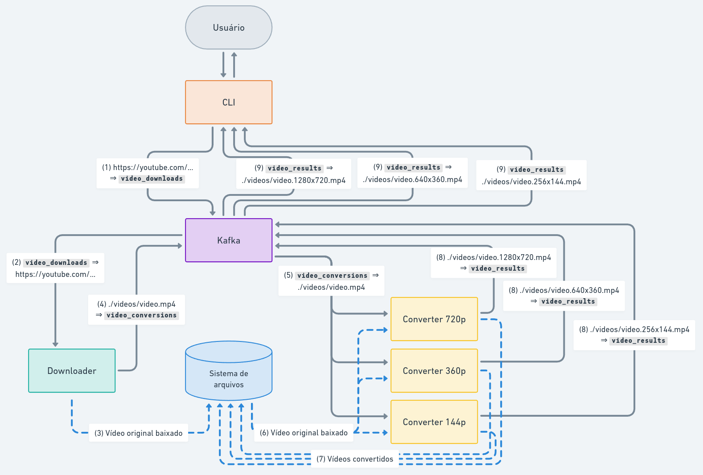

# Conversor de Vídeos Distribuído com Kafka

https://github.com/diego-aquino/kafka-video-converter/assets/58959382/4d6e0398-f9f2-49e7-b49b-aa0e15c84c97

Este projeto foi desenvolvido como parte da disciplina de Sistemas Distribuídos 2023.2 da UFCG (Universidade Federal de
Campina Grande). O objetivo foi criar um conversor de vídeos distribuído utilizando o [Apache
Kafka](https://kafka.apache.org).

A configuração inicial do projeto seguiu o [Guia básico:
Kafka](https://raissonsouto.notion.site/Guia-b-sico-Kafka-8dfda6e07595409380e36202d000455c) da disciplina, feito por [@raissonsouto](https://github.com/raissonsouto).

- [Conversor de Vídeos Distribuído com Kafka](#conversor-de-vídeos-distribuído-com-kafka)
  - [Funcionamento](#funcionamento)
  - [Execução](#execução)
    - [1. Pré-requisitos](#1-pré-requisitos)
    - [2. Configuração do ambiente virtual](#2-configuração-do-ambiente-virtual)
    - [3. Instalação das dependências](#3-instalação-das-dependências)
    - [4. Execução](#4-execução)

## Funcionamento



1. Uma CLI ([`cli.py`](./src/cli.py)) recebe URLs de vídeos do [YouTube](https://www.youtube.com) de um terminal. Ao
   receber uma URL, uma mensagem será publicada no tópico `video_downloads` com a URL do vídeo.
2. Um grupo de downloaders ([`video_downloader.py`](./src/video_downloader.py)) estará escutando o tópico
   `video_downloads` e um deles receberá a mensagem de download.
3. O worker de download baixará o vídeo usando [`yt-dlp`](https://github.com/yt-dlp/yt-dlp) para `./videos/downloads`.
4. Quando o download for finalizado, o worker de download publicará uma mensagem no tópico `video_conversions` com o
   caminho do vídeo original baixado.
5. Um grupo de conversores ([`video_converter.py`](./src/video_converter.py)) estará escutando no tópico
   `video_conversions`. Cada um desses workers de conversão tem uma resolução de saída configurada (ex.: `720p`, `360p`,
   `144p`, etc.).
6. Um worker de conversão de cada resolução receberá o caminho do vídeo baixado e fará a conversão utilizando
   [`ffmpeg-python`](https://github.com/kkroening/ffmpeg-python). A conversão é feita em paralelo para cada resolução.
7. Após as conversões, os vídeos gerados são salvos em `./videos/converted`.
8. Quando cada conversão finaliza, uma mensagem é publicada no tópico `video_results` contendo o caminho do arquivo
   convertido.
9. A CLI estará escutando no tópico `video_results` e mostrará no terminal os caminhos dos arquivos gerados.

## Execução

### 1. Pré-requisitos

- [Python 3.10](https://www.python.org/downloads/)
- [Docker](https://docs.docker.com/engine/install/)
- [ffmpeg](https://ffmpeg.org/download.html)

### 2. Configuração do ambiente virtual

```bash
python -m venv venv
source venv/bin/activate
```

### 3. Instalação das dependências

```bash
pip install -r requirements.txt
```

### 4. Execução

1. Inicie o servidor do Kafka em um terminal:

   ```bash
   docker compose up kafka
   ```

> [!NOTE]
>
> Se você estiver usando Linux, pode ser necessário adicionar o hostname `kafka` para `127.0.0.1` no arquivo `/etc/hosts`, como mostrado abaixo:
>
> ```
> 127.0.0.1       localhost kafka
> ```

2. Em um segundo terminal, inicie os workers de download e conversão:

   ```bash
   bash scripts/workers.sh 1280:720 640:360 256:144
   ```

   Este comando inicia 1 worker de download e 3 workers de conversão para 1280x720, 640x360 e 256x144.

3. Em um terceiro terminal, inicie a CLI:

   ```bash
   bash scripts/cli.sh
   ```

   Aguarde o prompt, cole uma URL de vídeo do YouTube e pressione Enter. Você poderá acompanhar o progresso no terminal
   dos workers. Conforme os vídeos são baixados e convertidos, arquivos gerados serão exibidos no terminal da CLI.
